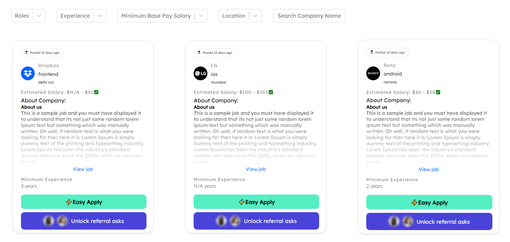

# Steps to run the code

-Clone the github repository
-Install the requirements using npm install. If it didn't succeed try using npm install --force.
-Start the development server using npm start
-Open http://localhost:3000 with your browser to see the result.

# Technologies Used 

-ReactJs
-Redux
-CSS
-Material UI

# Hosted on site 
https://weekday-assignment-pied-one.vercel.app/

# Folder Structure
Project folder contains the src folder where all the code resides.
The src folder has an main page App.js of the project .
The src folder has another folder named components where the custom created UI components are stored.

# Functionalities Implemented
Job Cards
Filters
Infinite Scroll
Responsive Design

# Responsiveness
The UI created is Responsive.

# Project Image

